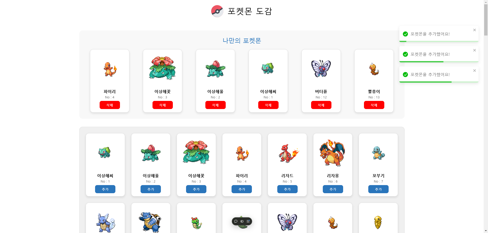
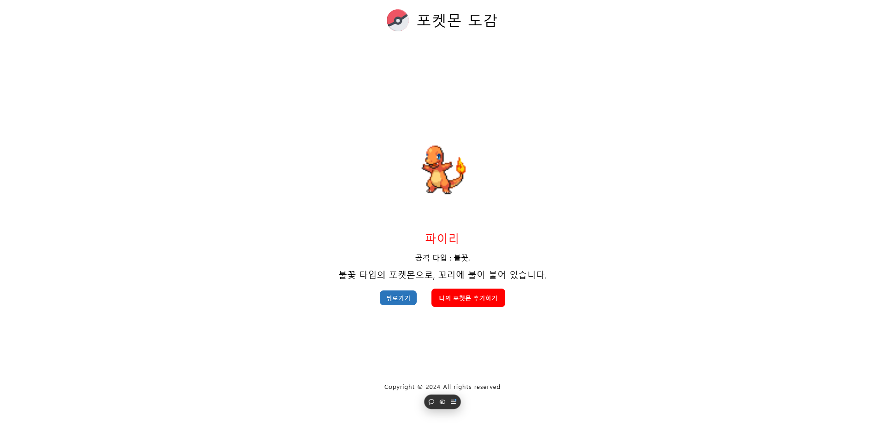

# 🌟 Pokemon Dex Project

포켓몬 도감 프로젝트는 React를 활용하여 포켓몬을 선택하고 관리할 수 있는 웹 애플리케이션입니다.


## 📑 프로젝트 소개

Pokemon Dex Projext는 총 151마리의 포켓몬을 나의 몬스터볼에 추가, 삭제 할 수 있는 웹 애플리케이션으로 최대 6마리까지 추가할 수 있습니다. Props Drilling과 Context API, Redux Toolkit의 차이와 활용방법에 대해 공부하고,
React Router를 활용한 페이지 라우팅을 구현했습니다.


## 📌 기능

- **포켓몬 선택 및 관리**:
  - 최대 6마리의 포켓몬을 선택하여 관리할 수 있습니다.
- **상세 정보 확인**:
  - 각 포켓몬의 상세 정보를 확인할 수 있는 디테일 페이지를 제공합니다.
- **실시간 알림**:
  - 중복 선택이나 최대 선택 수 초과 시 알림을 제공합니다.


## 📁 프로젝트 구조

```
src/
├── components/
│   ├── common/
│   ├── layout/
│   ├── sections/
│   ├── shared/
│   └── ui/
├── data/
├── hooks/
├── pages/
│   ├── HomePage/
│   ├── PokemonDetailPage/
│   └── PokemonDexPage/
├── redux/
│   ├── config/
│   └── slice/
└── styles/
    └── GlobalStyle.js
```


## 🔨 기술 스택

- React
- React Router Dom
- Styled-Components
- Context API
- redux toolkit
- react-toastify
- Vite


## 🏃‍♂️ 프로젝트 실행 방법

```bash
# 프로젝트 클론
git clone https://github.com/your-username/pokemon-dex.git

# 의존성 설치
yarn, yarn install

# 개발 서버 실행
yarn dev
```


## 📱 화면 구성

|           홈 페이지            |         도감 페이지          |            상세 페이지             |
| :----------------------------: | :--------------------------: | :--------------------------------: |
|  |  |  |


## 🌈 주요 페이지

### Home (/)

- 프로젝트 소개 및 시작 버튼 제공
- Dex 페이지로 이동할 수 있는 네비게이션

### Dex (/dex)

- 포켓몬 목록 표시
- 포켓몬 선택 및 관리 기능
- 선택된 포켓몬 대시보드 표시

### Detail (/pokemon-dex/:id)

- 포켓몬 상세 정보 표시
- 이전 페이지로 돌아가기 기능


## 👨‍💻 구현 내용

### Props Drilling 브랜치

- 컴포넌트 간 데이터 전달을 props를 통해 구현
- 상태 관리의 기본적인 패턴 학습

### Context 브랜치

- Context API를 활용한 전역 상태 관리 구현
- Props Drilling 문제 해결

### redux 브랜치

- Redux Toolkit으로 상태 관리 리팩토링
- 디테일 페이지에 추가 버튼 구현
- 페이지 전환 시 상태 유지
- UI 라이브러리를 활용한 알림 기능 개선
- custom hook을 활용한 데이터 페칭


## 📝 프로젝트 회고

### 어려웠던 점

- Redux Toolkit 을 활용한 상태관리 및 동작 방식
- react-router-dom의 createBrowserRouter 와 BrowserRouter

### 배운 점

- 전역 상태 관리의 중요성
- Git 브랜치 전략 활용 방법

## 🔗 배포 링크

- [포켓몬 도감](https://react-pokemon-dex.vercel.app/)
- [GitHub Repository](https://github.com/Kminhoo/react-pokemon-dex)
